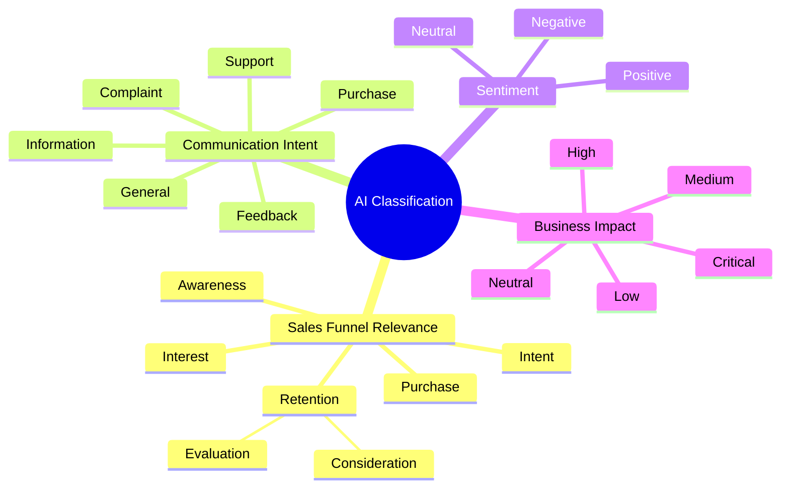
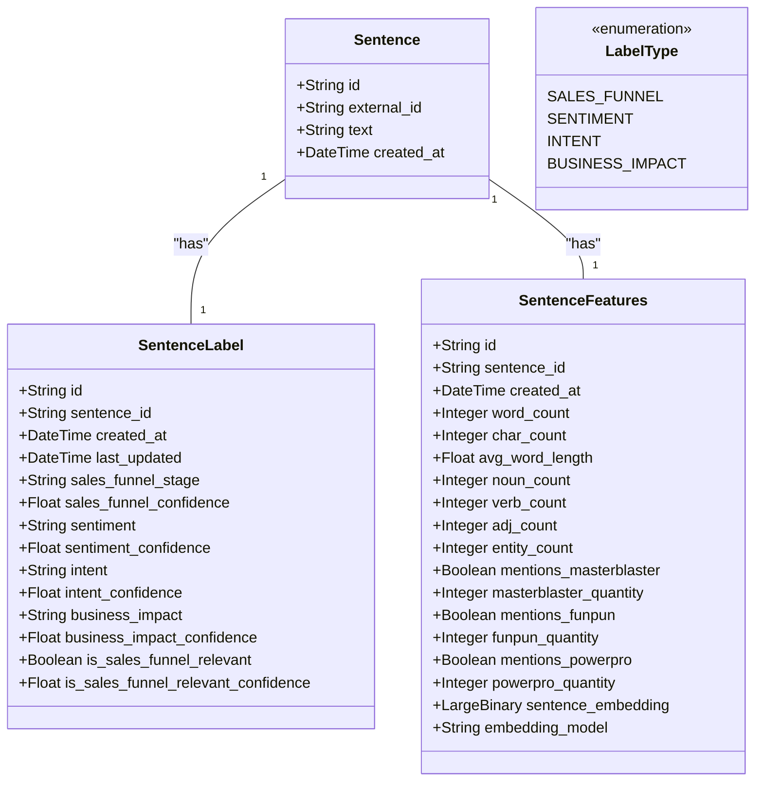
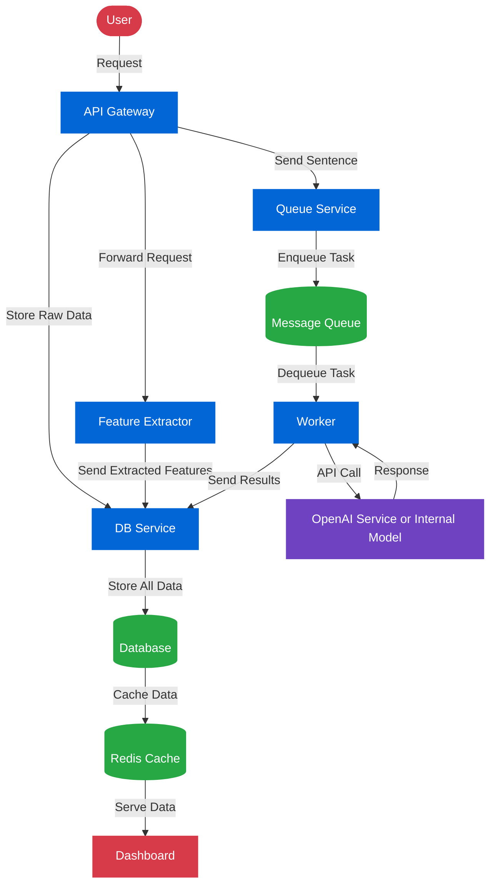

# Customer Conversation Analytics

## Overview
This document describes the approach and architecture of my data processing and visualization analytics system. The system consists of multiple components that work together to process, store, and visualize data from customer conversations - these could include feedback, general notes, or sales funnel relevant information.

Imagine having conversation snippets like these (generated with Claude.AI, representing information provided by customers):
```plaintext
[
  {"id": 0, "sentence": "Unfortunately, we have to decline the FunPun quotation as we've secured a better offer."},
  {"id": 1, "sentence": "We are planning to order 500 units of FunPun for our upcoming initiative."},
  {"id": 2, "sentence": "Could you provide a quotation for the FunPun solution?"},
  {"id": 3, "sentence": "Just a heads-up, Alex is no longer our key account manager."},
  {"id": 4, "sentence": "I'm afraid we can't proceed with the FunPun quotation as it's above our budget."},
  {"id": 5, "sentence": "I'll be presenting our latest innovations at the European Sales Summit in Brussels next month."},
  {"id": 6, "sentence": "We're truly impressed by the level of customer support."},
  {"id": 7, "sentence": "We're extremely pleased with how the implementation process has gone."},
  {"id": 8, "sentence": "Your support team has exceeded our expectations."},
  {"id": 9, "sentence": "Curious about the pricing of the MasterBlaster solution."},
  {"id": 10, "sentence": "We're highly satisfied with the responsiveness of your support team."},
  {"id": 11, "sentence": "The new online ordering platform should go live by the end of Q3, replacing all paper-based processes.},
  {"id": 12, "sentence": "Can you send a quote for the PowerPro solution?"},
  {"id": 13, "sentence": "The training sessions have been quite effective for our team."},
  {"id": 14, "sentence": "We're very impressed with the impact of the training sessions."}
]

```

The developed system should be able to visualize and interact with this data in an intuitive, interpretable and actionable way. 

## Classification Targets

To make sense of the conversations, I extracted features and provided labels in the form of classifications. Lets start with the classifications.
I simply used OpenAIs 3.5-turbo model as a baseline. Classification of each sentence was done using four major dimensions:



## Labels Sneak Preview


## Features Sneak Preview


## Classification Results


## Data Model

Get labels and features for the sentences. The focus on labels was already discussed, the choice of features was to get a simple set to start with, but generally these features can be extended later anyway, e.g. by n-grams, the presence of specific characters like questionmarks or readability metrics, which we will do later when we develop our own classifier.


## Functional Requirements


# I also want to focus heavily on non-functional requirements and product strategy, mainly:

1. Maintainability
2. Scalability
3. Robustness
4. Deployability
5. Fast Iterations using Customer Feedback and an imperfect MVP, going the lean and agile way.

I need an architecture which is fast, can handle changing requirements, can be scaled and is cheap. I want to iterate quickly to pivot into better product strategies if necessary.
So I came up with the following architecture for an MVP:

- Input: Sentences
- Output: Interactive Dashboard 

## Architecture Diagram



```mermaid
flowchart TD
    %% Title and Description
    title[ML System Architecture with Fault Tolerance]
    
    %% User Interaction Layer
    Users([Load Balancer]) -->|Distributed Requests| APIGateway[API Gateway Cluster]
    
    %% API Gateway Layer
    APIGateway -->|Rate Limited| AuthService[Auth & Validation Service]
    AuthService -->|Validated| RequestRouter[Request Router]
    
    %% Request Routing and Distribution
    RequestRouter -->|Distributed Tasks| TaskOrchestrator[Distributed Task Orchestrator]
    
    %% Feature Extraction Microservices
    TaskOrchestrator -->|Parallel Processing| FeatureExtractorCluster[Feature Extractor Cluster]
    
    %% Queueing and Message Routing
    FeatureExtractorCluster -.->|Reliable Messaging| KafkaCluster[(Kafka Cluster)]
    KafkaCluster -->|Partitioned Streams| WorkerCluster[Elastic Worker Cluster]
    
    %% Model Inference Layer
    WorkerCluster -->|Inference Request| ModelRouter[ML Model Router]
    ModelRouter -->|Load Balanced| ModelServices[Model Services]
    
    %% Model Services Details
    ModelServices -->|OpenAI API| OpenAI([OpenAI])
    ModelServices -->|Internal Models| InternalModels([Internal Models])
    ModelServices -->|Fallback Strategy| FallbackModels([Fallback Models])
    
    %% Data Persistence and Caching
    ModelServices -->|Store Results| DatabaseCluster[(Database Cluster)]
    DatabaseCluster -->|Replicated Data| RedisCluster[(Redis Cluster)]
    
    %% Monitoring and Observability
    DatabaseCluster -.->|Metrics & Logs| Prometheus[Prometheus Monitoring]
    Prometheus -->|Alerts| AlertManager[Alert Manager]
    
    %% Dashboard and Visualization
    RedisCluster -->|Cached Data| DashboardService[Dashboard Microservice]
    DashboardService -->|Streaming Updates| WebSocketCluster[WebSocket Cluster]
    
    %% System Metrics
    subgraph SystemMetrics[System Metrics]
        Latency[Latency: 150-250ms]
        Throughput[Throughput: 1000 req/sec]
        Availability[Availability: 99.99%]
        RecoveryTime[Recovery Time: <3min]
    end
    
    %% Fault Tolerance Components
    subgraph FaultTolerance[Fault Tolerance]
        CircuitBreaker[Circuit Breaker]
        RetryMechanism[Retry Mechanism]
        FallbackPolicies[Fallback Policies]
        HealthChecks[Health Monitoring]
        GracefulDegradation[Graceful Degradation]
    end
    
    %% Layer Labels
    subgraph UserLayer[User Interaction Layer]
        Users
    end
    
    subgraph APILayer[API Gateway Layer]
        APIGateway
        AuthService
        RequestRouter
    end
    
    subgraph ProcessingLayer[Processing Layer]
        TaskOrchestrator
        FeatureExtractorCluster
    end
    
    subgraph MessagingLayer[Messaging Layer]
        KafkaCluster
    end
    
    subgraph InferenceLayer[Inference Layer]
        WorkerCluster
        ModelRouter
        ModelServices
        OpenAI
        InternalModels
        FallbackModels
    end
    
    subgraph StorageLayer[Storage Layer]
        DatabaseCluster
        RedisCluster
    end
    
    subgraph MonitoringLayer[Monitoring Layer]
        Prometheus
        AlertManager
        DashboardService
        WebSocketCluster
    end
    
    %% Styling
    classDef default fill:#f9f9f9,stroke:#999,stroke-width:1px,color:#333,font-size:14px
    classDef service fill:#0366d6,stroke:#0366d6,color:white,font-weight:bold
    classDef storage fill:#28a745,stroke:#28a745,color:white,font-weight:bold
    classDef external fill:#6f42c1,stroke:#6f42c1,color:white,font-weight:bold
    classDef user fill:#d73a49,stroke:#d73a49,color:white,font-weight:bold
    classDef monitoring fill:#f66a0a,stroke:#f66a0a,color:white,font-weight:bold
    classDef metrics fill:#f0f7ff,stroke:#999,color:#333
    classDef subgraph fill:#f5f5f5,stroke:#ddd,color:#333,font-weight:bold
    
    class APIGateway,AuthService,RequestRouter,TaskOrchestrator,FeatureExtractorCluster,WorkerCluster,ModelRouter,DashboardService,WebSocketCluster service
    class KafkaCluster,DatabaseCluster,RedisCluster storage
    class ModelServices,OpenAI,InternalModels,FallbackModels external
    class Users user
    class Prometheus,AlertManager monitoring
    class Latency,Throughput,Availability,RecoveryTime metrics
    class UserLayer,APILayer,ProcessingLayer,MessagingLayer,InferenceLayer,StorageLayer,MonitoringLayer,SystemMetrics,FaultTolerance subgraph
```

## Components

### API Gateway

- Serves as the entry point for all user requests
- Forwards requests to the Feature Extractor for processing
- Sends raw data to the DB Service for storage
- Enqueues tasks in the Message Queue for asynchronous processing

### Feature Extractor

- Processes input data to extract relevant features
- Stores extracted features in the database
- Optimized for rapid feature analysis and extraction

### DB Service

- Receives raw input data from the API Gateway
- Responsible for storing unprocessed data in the database
- Handles database connections and transactions

### Message Queue (Service)

- Maintains a queue of tasks to be processed asynchronously
- Provides reliable task delivery to the Worker
- Supports prioritization and retry mechanisms

### Worker

- Consumes tasks from the Message Queue
- Makes API calls to OpenAI for advanced processing
- Stores processing results back to the database

### Database

- Central data store for the entire system
- Stores raw input data, extracted features, and processing results
- Provides persistent storage with data integrity guarantees

### Redis Cache

- Caches frequently accessed data from the database
- Reduces database load and improves dashboard performance
- Implements efficient invalidation strategies (not yet)

### Dashboard

- Provides visualization of processed data
- Retrieves data from Redis cache for optimal performance
- Offers interactive data exploration capabilities

## Tech Stack

- Python 3.12
- Nginx
- Poetry
- Streamlit
- PostgreSQL
- RabbitMQ
- RESTfulAPI
- Docker


## Data Flow

- User sends a request to the API Gateway
  
1. The API Gateway
   - forwards the request to the Feature Extractor
   - Sends raw data to the DB Service
   - Enqueues a task in the Message Queue
3. DB Service stores the raw data in the database 
4. Feature Extractor processes the data and stores features in the database
5. Worker pulls tasks from the Message Queue
6. Worker makes API calls to OpenAI and stores results in the database
7. Redis caches relevant data from the database
8. Dashboard retrieves data from Redis to display visualizations


## Dashboard Sneak Preview


## Deployment Considerations

- Each component can be deployed as a separate microservice
- Database and Redis should be configured for high availability
- Consider using auto-scaling for API Gateway, Worker, and Feature Extractor based on load
- Implement appropriate monitoring and alerting for all components

## Future Enhancements

0. Over time create customer - client specific sales funnels and models (R&D)
1. Add service specific databases and db_services (scalability)
2. Implement more sophisticated caching strategies (user experience)
3. Add real-time processing capabilities (monitoring)
4. Expand dashboard functionality with additional visualization options (user experience)

# Setup

1. Start a redis server locally
2. Have postgre server installed locally
3. Have rabbitmq installed and running locally
4. Clone repository
5. Run ./tests/ingestion.py for populating the database

# Application Startup
1. Navigate to root of project
2. have honcho installed with pip install honcho
3. Run honcho start


```
