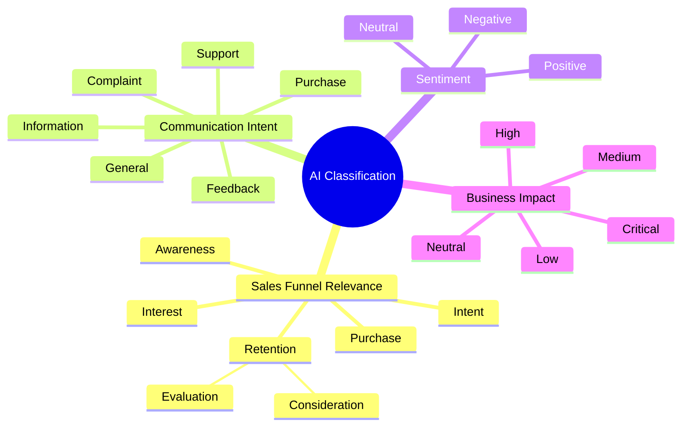
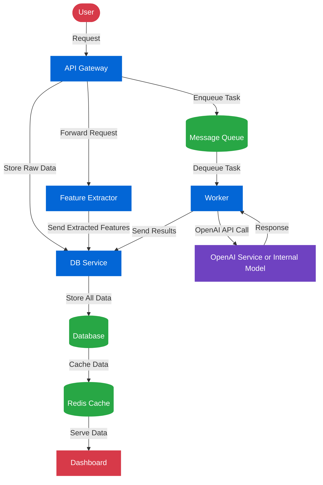

# voiceLine Task 3

## Overview
This document describes the architecture of my data processing and visualization system. The system consists of multiple components that work together to process, store, and visualize data from the sales environment.

## Classification Targets

To make sense of the provided sentences, I extracted features and provided labels in the form of classifications. Lets start with the classifications.
I simply used OpenAIs 3.5-turbo model as a baseline. Classification of each sentence was done using four major dimensions:




## Labels Sneak Preview


## Features Sneak Preview


# As a CTO, I also focus heavily on non-functional requirements and product strategy.

1. Maintainability
2. Scalability
3. Robustness
4. Test Coverage
5. Deployment ready architecture
6. Fast Iteration using Customer Feedback asap

I need an architecture which is fast, can handle changing requirements, can be scaled and is cheap. I want to iterate quickly to pivot into better product strategies.
So I came up with the following architecture for an MVP:

- Input: Sentences
- Output: Interactive Dashboard 

## Architecture Diagram



## Components

### API Gateway

- Serves as the entry point for all user requests
- Forwards requests to the Feature Extractor for processing
- Sends raw data to the DB Service for storage
- Enqueues tasks in the Message Queue for asynchronous processing

### Feature Extractor

- Processes input data to extract relevant features
- Stores extracted features in the database
- Optimized for rapid feature analysis and extraction

### DB Service

- Receives raw input data from the API Gateway
- Responsible for storing unprocessed data in the database
- Handles database connections and transactions

### Message Queue

- Maintains a queue of tasks to be processed asynchronously
- Provides reliable task delivery to the Worker
- Supports prioritization and retry mechanisms

### Worker

- Consumes tasks from the Message Queue
- Makes API calls to OpenAI for advanced processing
- Stores processing results back to the database

### Database

- Central data store for the entire system
- Stores raw input data, extracted features, and processing results
- Provides persistent storage with data integrity guarantees

### Redis Cache

- Caches frequently accessed data from the database
- Reduces database load and improves dashboard performance
- Implements efficient invalidation strategies (not yet)

### Dashboard

- Provides visualization of processed data
- Retrieves data from Redis cache for optimal performance
- Offers interactive data exploration capabilities

### Data Flow

- User sends a request to the API Gateway
  
1. The API Gateway
   - forwards the request to the Feature Extractor
   - Sends raw data to the DB Service
   - Enqueues a task in the Message Queue
3. Feature Extractor processes the data synchronously and stores features in the database
4. DB Service stores the raw data in the database
5. Worker pulls tasks from the Message Queue
6. Worker makes API calls to OpenAI and stores results in the database asynchronously
7. Redis caches relevant data from the database
8. Dashboard retrieves data from Redis to display visualizations


## TechStack

- Python 3.12
- Nginx
- Poetry
- Streamlit
- PostgreSQL
- RabbitMQ
- RESTfulAPI
- Docker


## Dashboard Sneak Preview


## Deployment Considerations

- Each component can be deployed as a separate microservice
- Database and Redis should be configured for high availability
- Consider using auto-scaling for API Gateway, Worker, and Feature Extractor based on load
- Implement appropriate monitoring and alerting for all components

## Future Enhancements

0. Over time create customer - client specific sales funnels and models
1. Add service specific databases and db_services
2. Implement more sophisticated caching strategies
3. Add real-time processing capabilities
4. Expand dashboard functionality with additional visualization options

# Setup

1. Start a redis server installed and started locally
2. Have postgre server installed locally
3. Have rabbitmq installed and running locally
4. Clone repository

# Application Startup
1. Navigate to root of project
2. have honcho installed with pip install honcho
3. Run honcho start


```
